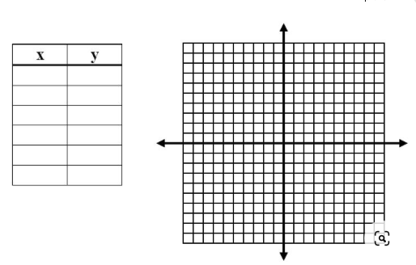

# Week 3

## Data can be 

- Primitive
  - Data type given by the compiler
  - Integers, shorts, char

- Composite
  - Combination of primitive types
  - String

Example:

```java
int x = 4; // 4

int[] y = new int[4]; // Stores address, reference.
```

## Functions/ Behaviour

- Pure 
    - Input -> x -> output  
    - same input same output
    - Illustration:


- Inpure
    - side effect
    - output is not always guaranteed
    - Functions are not pure because action is not contained
    - Illustration:


## Defining Objects in Java

In Java, a class is a blueprint for creating objects. Here's the typical structure of a Java class:

```java
class <className> {
     Fields (Instance Variables)
    // Describe the attributes or properties of the class here.

    Constructors
    // Define one or more constructors to initialize objects.

    Methods
    // Define the behaviors or actions of the class here.
}

```
### Important Things to know.

- `int x;` --> **Declaration**
- `x = 4;` --> **Assignment**
- `int[] y;` --> **Declaration**
- `y = new int[4];` --> **Construction of an Object in Memory with Value 4;**

  Where:
  - `y` = **Assignment**
  - `new` = **Construction**
  - `int[4]` = **Initialization**
  - `new int[4]` = **Instantiation**

### Declarative vs Imperative Languages
**Declarative Language (ex, Python):**

In a declarative language, you can directly assign a value to a variable without specifying the variable's type explicitly:

```python
x = 4  # Direct assignment of a value to a variable (x) without declaring its type.
```

**Imperative Languages (ex, C and Java):**

In imperative languages like C and Java, you typically need to declare the variable's type explicitly before assigning a value:
```java
int x;   // Declaration of a variable (x) with its type (int).
x = 4;   // Assignment of a value to the declared variable.
```

## Functions
**Fuction structure in java:**
```java
<return type> <function name> <intput parameter>
{
  return value (if any)
}
```

Example computing F(x) = {2x,4x,20x}

```java
public static int[] computeValues(int x) {
        int[] result = new int[3]; // Create an array to store the  results

        // Compute the values
        result[0] = 2 * x;
        result[1] = 4 * x;
        result[2] = 20 * x;

        return result; // Return the array containing the computed values
    }

    public static void main(String[] args) {
        int x = 4;
        int[] values = computeValues(x);

        //print
    }
}
```
## Recursive
Computing: n! = n * (n-1)!

```java
public class FactorialCalculator {
    public static long factorial(int n) {
        if (n == 0 || n == 1) {
            // Base case: 0! and 1! are both equal to 1
            return 1;
        } else {
            // Recursive case: n! = n * (n-1)!
            return (long) n * factorial(n - 1);
        }
    }

    public static void main(String[] args) {
        int n = 5; // Change this value to compute the factorial of a different number
        long result = factorial(n);
        System.out.println(n + "! = " + result);
    }
}
```
Issues with Recursive:

- **Stack Overflow**: Recursion can lead to stack overflow errors when the recursion depth is too deep.

- **Performance Overhead**: Recursive calls can introduce function call overhead and additional memory usage.

- **Readability and Maintainability**: Recursive code can be harder to understand and maintain, especially for newcomers.

- **Limited Tail Call Optimization**: Many languages lack efficient tail call optimization for recursive functions.

- **Risk of Infinite Recursion**: Improperly implemented recursion can result in infinite loops, causing program issues.

- **Not Suitable for All Problems**: Not all problems are well-suited for recursive solutions, making it important to choose the right tool for the job.


## Tail call recursion
```java
public class FactorialCalculator {
    public static long factorial(int n) {
        return factorialTailRecursive(n, 1);
    }

    private static long factorialTailRecursive(int n, long accumulator) {
        if (n == 0 || n == 1) {
            return accumulator;
        } else {
            return factorialTailRecursive(n - 1, n * accumulator);
        }
    }

    public static void main(String[] args) {
        int n = 5; // Change this value to compute the factorial of a different number
        long result = factorial(n);
        System.out.println(n + "! = " + result);
    }
}
```

## Classes

**In object-oriented programming, classes are used to create self-contained objects that encapsulate both data and behavior.**

Ex: Creating Points on Coordinage Plane.

```java
public class Point {
    // Fields
    private int x;
    private int y;

    // Constructor
    public Point(int x, int y) {
        this.x = x;
        this.y = y;
    }
    //method that calculates Distance
    public double calculateDistance(Point P) {
          int deltaX = this.x - P.x;
          int deltaY = this.y - P.y;
          return Math.sqrt(Math.pow(deltaX,2)+ Math.pow(deltaY * deltaY));
      }

```

