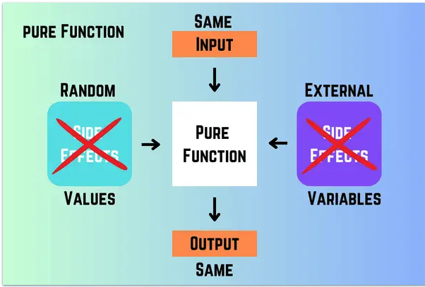
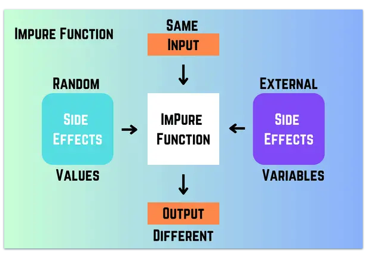

# Week 3

## Data can be 

- Primitive
  - Data type given by the compiler
  - Integers, shorts, char

- Composite
  - Combination of primitive types
  - String

Example:

```java
int x = 4; // 4

int[] y = new int[4]; // Stores address, reference.
```

# Functions/ Behaviour

- Pure 
    - Input -> x -> output  
    - same input same output
    - Illustration:


- Inpure
    - side effect
    - output is not always guaranteed
    - Functions are not pure because action is not contained
    - Illustration:



